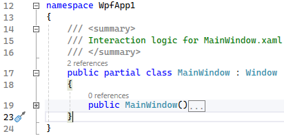

# Bring Back Plus/Minus

This extension brings back the plus/minus symbols to the editor outlining feature of Visual Studio 2022 17.9 and later. Simply clone this repo, open `BringBackPlusMinus.sln` in Visual Studio, F5 to run the extension and the plus/minus symbols in the editor outline will be back in the experimental instance of VS.
